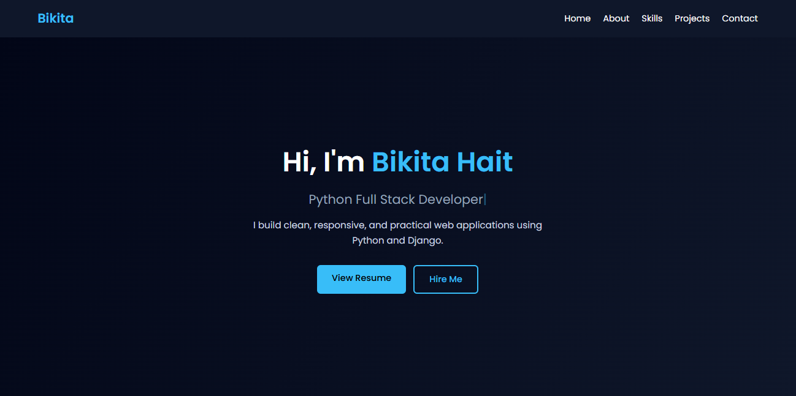
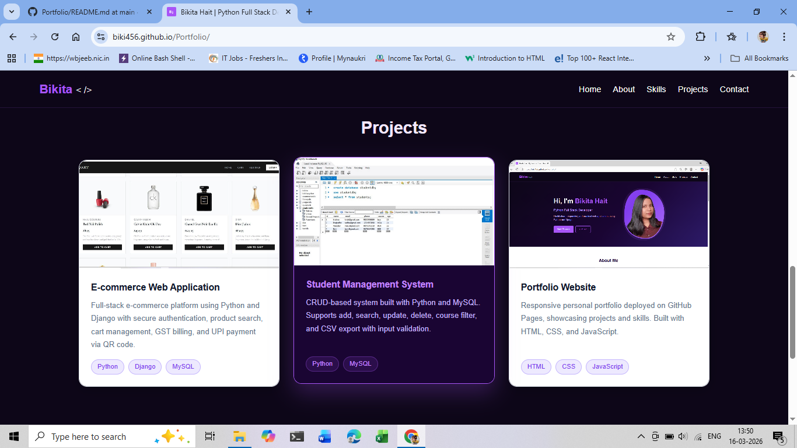

# Bikita Hait — Portfolio Website

Personal portfolio website created to showcase my skills, projects, and contact information.  
The website is fully responsive and deployed using GitHub Pages.

🔗 **Live Website:**  
https://biki456.github.io/Portfolio

---

## Project Description

This is my personal developer portfolio designed to highlight my work as an aspiring Python Full Stack Developer. The website presents my profile, technical skills, projects, and contact details in a clean and modern interface.

---

## Features

- Responsive portfolio layout
- Dark purple themed UI design
- Typing animation in hero section
- Profile photo with glow effect
- Interactive project cards with hover effects
- Skills section with animations
- Contact section with Email, GitHub, and LinkedIn links
- Mobile-friendly navigation with hamburger menu

---

## Projects Showcased

| Project | Technology | Link |
|-------|-------|-------|
| QART E-commerce | Python, Django, MySQL | https://github.com/biki456/Qart-Ecommece |
| Student Management System | Python, MySQL | https://github.com/biki456/student-management-system-CRUD |
| Portfolio Website | HTML, CSS, JavaScript | https://biki456.github.io/Portfolio |

---

## Technologies Used

- HTML5
- CSS3
- JavaScript
- Font Awesome Icons
- Git & GitHub
- GitHub Pages (Deployment)

---

## Screenshots

Add screenshots of your portfolio here.

Example:

  
  

---

## How to Run the Project

1. Clone the repository
git clone https://github.com/biki456/Portfolio.git

2. Open the project folder

3. Run the project by opening **index.html** in your browser.

---

## Author

**Bikita Hait**  
Python Full Stack Developer

GitHub: https://github.com/biki456  
LinkedIn: https://www.linkedin.com/in/bikita-hait-2b59b91b3  
Email: haitbikita@gmail.com
